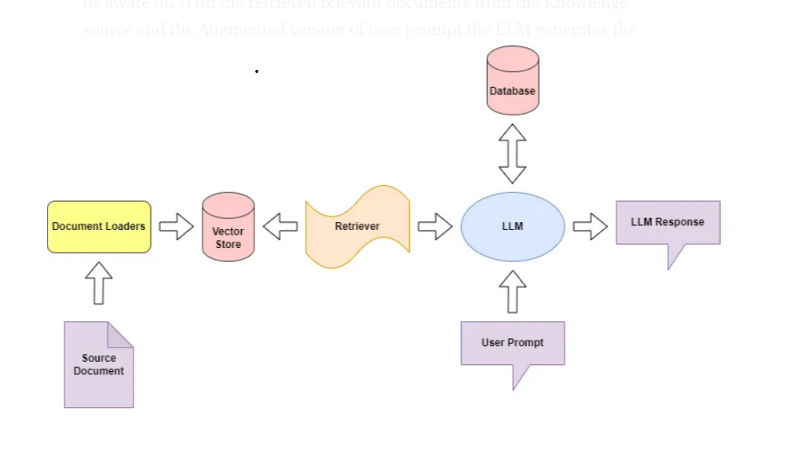

# LocalRAG

# INTRODUCTION

LocalRAG (Retrieval-Augmented Generation) is an advanced Local running LLM application designed to leverage the power of Language Models (LLMs) for enhanced information retrieval and generation. This project is part of a broader learning initiative in the fields of LLMOps and GenAI. Built using LangChain, LocalRAG aims to provide efficient, secure and accurate responses by combining retrieval mechanisms with generative AI.

## Installation

1. **Clone the Repository:**
   ```bash
   git clone https://github.com/HemachandranD/awesome_llm_apps.git
   cd localrag

## Guide

This Guide will help you to deploy a Production level RAG application into your workstation/local machine or Server.
[Medium: LOCALRAG](https://medium.com/gopenai/deploy-a-production-grade-rag-chatbot-on-your-local-machine-or-server-localrag-9f6fdede6f54)

## Architecture



## Folder Tree

Data catalog and data engineering work should be split into layers (and folder structure). Avoid putting all data engineering in an overly complex and dense script or function. Following the convention below will ensure data transformations are traceable, easily understood, and maintainable.

```text
...
├── rag
│   ├── loader       <-- Corpus Preparation and chunking
│   ├── vstores      <-- Vectorize the Corpus uisng vector stores
│   ├── retrieval    <-- Implement the Retrieval & Genearation Component 
│   ├── utils        <-- Utility Functions
├── localrag.py      <-- main file to orchestrate the RAG APplication.
|── app.py           <-- Streamlit Application file
...
```

## [Document Loaders](rag/loader.py)

Document loaders is used to load data from a source as Document's. A Document is a piece of text and associated metadata.


Here, the load_data definition takes the file as an input along with the file type and returns the data in list of Documents.

Next step is to split the entire data into chunks as the LLM’s are known for token limit they are proven to be performing better on the right number of Tokens. I have set the chunk_size=600 with an overlap of 50 tokens in order not to lose the context of the data.

## [Vector Stores](rag/vstores.py)

One common way to handle unstructured data is by converting it into embedding vectors. These vectors are stored in a vector store, which helps in searching the data. At query time, the query is also converted into an embedding vector, and the vector store finds the most similar vectors to the query.

For LocalRAG, I used Qdrant, a robust platform for storing and searching embedding vectors. It will handle storing the embedded data and performing vector searches efficiently.

This process altogether is referred as indexing.

## [Retrieval & Genearation](rag/retrieval.py)

This part has two components,
- Retrieval Component
- Generation Component

A retriever is an interface that returns documents given an unstructured query. Vector stores can be used as the backbone of a retriever.
Retrievers accept a string query as input and return a list of Document's as output. In simple terms you can consider the retriever as an object for connecting your vector stores that holds the embedding vectors.

You shall notice that the connection to the existing vector store that was created during the Indexing. By using the method "as_retriever" we turn that connection into a retriever object which will retrieve the relevant docs using the similarity search technique.

Generation is performed based on the retrieved similar embedding vectors from the Query given given by the user. What happens under the hood is the query/question given as an input is turned into an embedding vectors and the similarity search is performed on the vector stores to gather the relative documents. From the retrieved documents the LLM genartes the response.

## Streamlit Application


